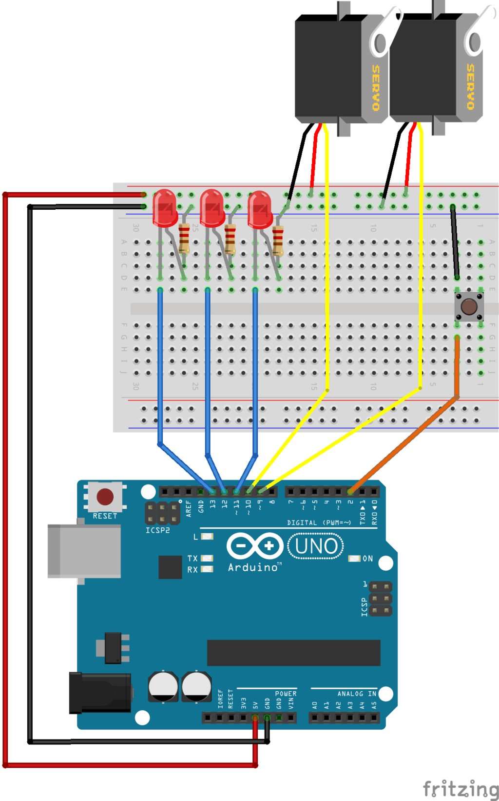
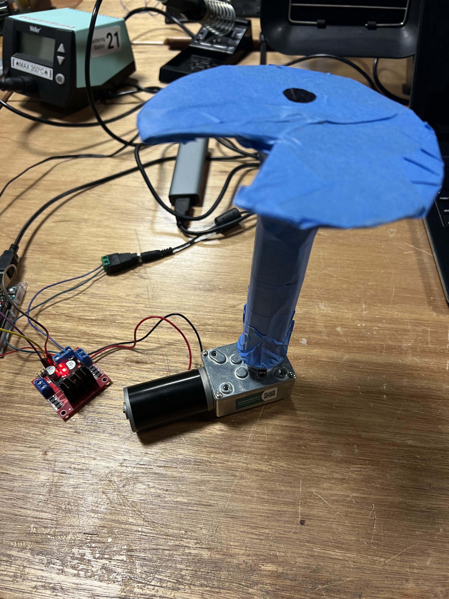
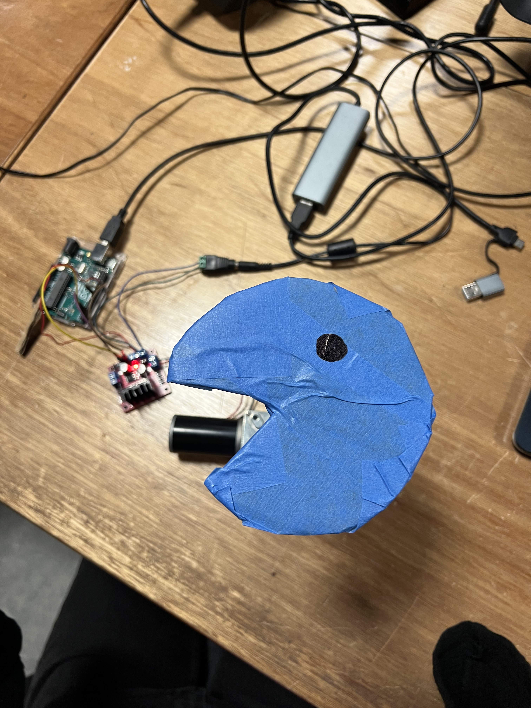

JOURNAL HOMEWORK - 29/01/2026

I had a lot of trouble getting my circuit and code to operate right during this project. One major issue was that my Arduino stopped responding and would not upload new programs. I later found out that this happened because of wiring issues and because I powered the servo motor directly from the Arduino, which sometimes made the board reset.

I believed the problem was with my coding at first. But once I tested the Arduino with the Blink example and took all the parts apart, I saw that the board itself was working fine. This made me realize that the problem was with my circuit. I fixed this by taking the circuit apart and putting it back together again, verifying each connection carefully.

I also had some trouble with the potentiometer and pushbutton. The Serial Monitor helped me see the values I was sending to the Arduino and how it was reading them. I found out that when you use INPUT_PULLUP, the button reads LOW when you press it, and the potentiometer values go from 0 to 1023.

I utilized the Serial Monitor to debug my project, tested each part on its own, checked my wiring to my schematic, and uploaded basic test scripts. These strategies helped me detect and rectify mistakes. This project taught me the importance of careful wiring, testing one part at a time, and staying patient when solving technical problems.

JOURNAL HOMEWORK - 3/02/2026

1.  The boat is the first module, starting from the left. The boat looks fine and the structure is still there, but it isn't moving at all. I think it was supposed to move or rock a little. The first thing I would do if I could get into the lab is check to see if the motor is getting power. I would try running a very simple Arduino sketch to see if the motor works. I would also check the wiring and pin assignments in the code again. I can't physically test anything right now, and I don't have clear documentation of how it was wired, which makes it hard to debug. It would be a lot easier if I had diagrams or comments in the code.

The carousel is the second module. The building, lights, and horses are all still there, so it looks like it's done. But it doesn't spin, which makes it feel like it's not finished. This is clearly a problem because a carousel that doesn't move doesn't make sense. To fix it, I would first test the motor on its own to make sure the code for rotation is actually running. I would also look to see if anything is in the way or if the gears are slipping. This one is harder to fix because the problem could be with the code, the wiring, or the mechanical system.

The tree is the third module. The tree itself is sturdy and stable, but it doesn't turn as it should. I remember that this part was supposed to turn slowly. I would check to see if the motor is strong enough and getting enough power if I were debugging it right now. I would also check that the code is using the right pins. One problem with this module is that the movement may have been very slow, so it might look broken even though it is working. That makes it harder to tell if it's a design flaw or a real problem.

The telegondola system is behind the tree. You can see the cables and gondolas, and the building looks finished, but nothing is moving. Because it's in the background, it's harder to see clearly, which makes debugging even harder. To begin fixing it, I would first check the motor and pulley system, and then see if the code loop is running all the time. There could be something stuck, or the motor driver might not be set up right. It would be much easier to work on if this section was easier to see and get to.

The Ferris wheel on the right is the last module. The wheel is put together and the gondolas are attached, so it looks like it's done, but it doesn't move at all. This is clearly not working as it should because a Ferris wheel that doesn't turn is pointless. I would test the motor by itself, look for friction, and see if the structure is too heavy for the motor if I could get to the setup. The motor might not have enough power to turn the wheel. I would also check the timing and control code to make sure it is working right.

If I were debugging this project today, I would start by separating each module and testing it with very simple Arduino programs. Before I moved on to more complicated logic, I would check the power supplies, wiring, and motor drivers. You could also use the serial monitor more often to make sure that the code is running correctly.
I was thinking about using Arduino and mechanical pieces instead of a screen to make a real-life version of Pac-Man for my project. I don't think this is okay, though. This is still a relatively new notion, and nothing is set in stone yet.

2. I chose Pac-Man since it's a famous game that almost everyone recognizes. It appears like it might really happen that you could go through a maze and pick up dots. There are also obvious regulations, including not going near ghosts and trying to get everything. This makes it simple to turn into an actual game.

The most important point:

The fundamental idea is to construct a true maze board that looks like a Pac-Man map. You wouldn't play on a screen; you'd play on a physical board. Pac-Man would be a small piece that moves through the maze, like a ball or something with a magnet.

We could make the maze out of wood, cardboard, or plastic, depending on what we have. An Arduino would have motors and connections that control movement under or within the board.

Regulations:

The player can move Pac-Man with buttons or a joystick.

You can tell the Arduino to move Pac-Man in a given direction by hitting a button, but only if there isn't a wall in the way.

Making it work:

In real life, Pac-Man would walk through the maze instead of on a computer. One option is to employ magnets, with Pac-Man on top and a magnet underneath that moves it. This concept came to me as we talked about how to move things with sand. Another way is to utilize tracks or rails that the item can slide on.

The Arduino would inform the motors what to do and keep Pac-Man from hitting barriers.

Dots and Points:

For the dots, I could put in miniature buttons, beads, or sensors. When Pac-Man steps on one, it is "picked up." The Arduino can keep track of how many you have and show it with lights or sounds.

Power pellets may be bigger pieces that do something special, like make the ghosts move more slowly.

Spirits:

The ghosts would also be genuine things that move around in the maze. They might move about randomly, follow set paths, or try to catch Pac-Man in a simple way.

Every ghost might have its own engine. If a ghost touched Pac-Man and a sensor picked it up, he would lose a life.

Winning and Losing:

You win if you get all the dots.
You lose if a ghost catches you too many times.

The game would use:

- LEDs that last a long time

- A buzzer for sound effects

- A score display with numbers might work.

Things that work mechanically

There would be a lot of mechanical parts in this project, like motors, gears, rails, magnets, pulleys, moving platforms, and so on. If the maze is modular, I could even be able to change it later.

How It Would Work:

1. You press a button.

2. It reads it with Arduino.

3. The engine makes Pac-Man move.

4. The sensor checks for dots or ghosts.

5. Get an update on your scores or lives.

6. Lights and noises react.

7. The game is still going on.

Issues:

1. Things that could be hard:

2. Making sure everything goes together the right way

3. Stopping parts from getting stuck

4. Making the motion flow smoothly

5. Looking after all the wires

6. Making it stronger so it won't shatter

Thinking about it

This idea is great since it lets you code, build, and be creative all at the same time. It makes me think about how games work in the actual world, not just on a screen, like P5.js. I think it would be really fun and interesting to make a real-life Pac-Man game, even though this is only a rough idea for now.

The diary entry is only for ideas, and my final project might be different, but here is where I'm starting.

JOURNAL HOMEWORK - 4/02/2026

After I built my initial design and looked more closely at different mechanical systems, I noticed that I had already figured out how to build most of the important parts of my project, like the maze, the controls, the sensors, and the Arduino setup. But now that I know how the movement mechanics function, I know for sure that I need motors to make Pac-Man move smoothly and properly.

At first, I thought it would be easy to maneuver Pac-Man about the board, but now I see that it's much harder than I imagined. When employing magnets, rails, or an X-Y platform, you need to be very careful when creating and programming. The motors need to be strong, precise, and in the appropriate spot so that Pac-Man doesn't get trapped or stray off course.

I also noticed that it will be hard to operate more than one motor at once, like for Pac-Man and maybe the ghosts. I need to learn how to develop code that makes sure everything travels in the appropriate direction and at the right pace, as well as how to use motor drivers. If something is even a little bit wrong, the whole system might not work well.

This makes the project more difficult, but it also makes it more entertaining. I now realize that this project isn't just about developing a game; it's also about figuring things out, building things, and testing them. Before I add any more features, I need to focus on understanding how to use motors and design a movement system that works.

This makes me think that Pac-Man is more complicated than I imagined at first. It also makes me feel more ready to start creating.

JOURNAL HOMEWORK - 9/02/2026

For this assignment, I worked on getting a DC motor to run using an Arduino and a motor driver. At first, it seemed like it would be very straightforward, because the code was simple and everything powered on correctly. However, when I uploaded the program, the motor did not move at all.

This forced me to slow down and check every part of the system. I realized that in physical computing, even small wiring mistakes can completely stop a project from working. The first issue was that the Arduino pins I used in the wiring did not match the pins in the code. I also needed to make sure the enable pin on the motor driver was set HIGH, otherwise the motor channel stays disabled. After fixing these issues and double-checking the ground connection between the Arduino and the motor driver, the motor finally started spinning. Seeing it move for the first time was satisfying because it confirmed that the whole control system was working correctly.

The final wiring was simple: pins 2 and 3 controlled the direction, pin 9 enabled the motor, and the Arduino shared a ground with the motor driver. The motor itself was powered by an external 12V supply and connected to the output terminals of the driver.

After the motor was working, I moved on to the second part of the assignment, which was to build a very rough prototype of my Pac-Man mechanism. Since this was only meant to test the movement idea, I kept it extremely simple. I cut a Pac-Man shape out of cardboard and attached it directly to the motor shaft using the hub provided by Professor Shiloh. 

When the motor ran, the Pac-Man cutout rotated left and right. Even though this was not the final movement system, it successfully showed that the motor could animate the character. That was the main goal of the prototype.

The mechanism was very rough. The cardboard piece was not perfectly balanced, and the motion was not very precise. But it helped me confirm that the motor can create visible movement, which is an important step toward building the full maze system. In the future, I would use a proper hub and a guided track so that Pac-Man moves through the maze instead of just spinning.

This exercise made me realize how different physical design is from digital design. In programming, if something is slightly wrong, it usually still runs. With hardware, a single wrong wire or loose connection can stop everything. At the same time, it was rewarding to see the mechanism move, because it felt like the game idea was starting to become real instead of just something on a screen.

JOURNAL HOMEWORK - 12/02/2026
For this Thursday, I did not change anything in the code. Instead, I made a little mechanism from cardboard to keep the pacman in place because it was moving quite a lot and I was scared that it was going to fall off. I also used tape which was quite useful and made the mechanism even stronger. However, this is just a prototype. I don't think I will use tape for the final project.

